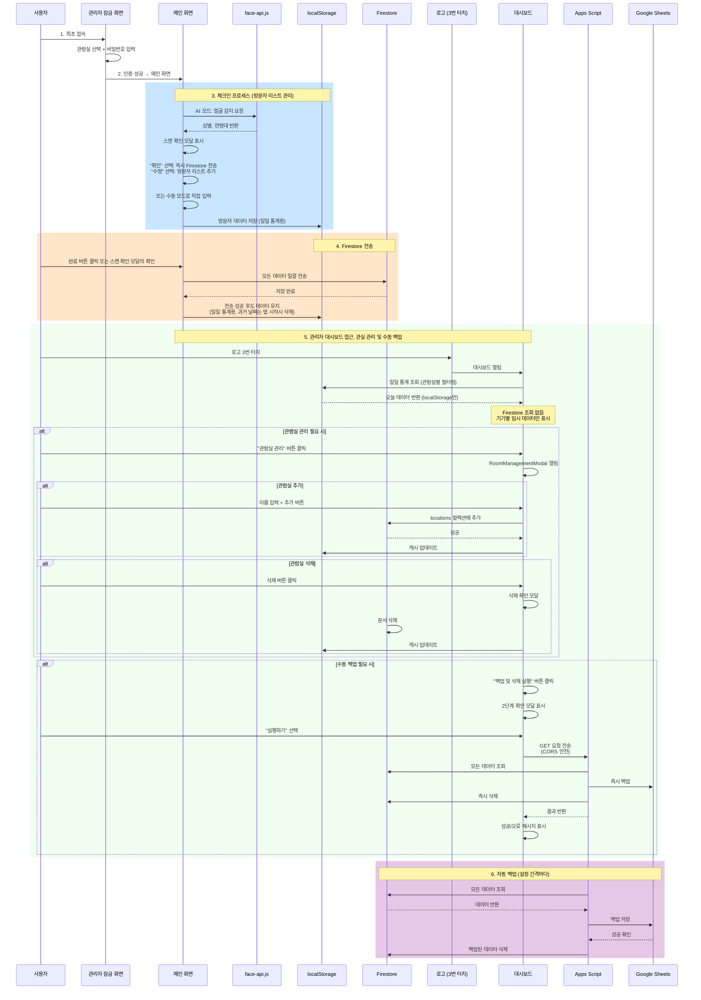
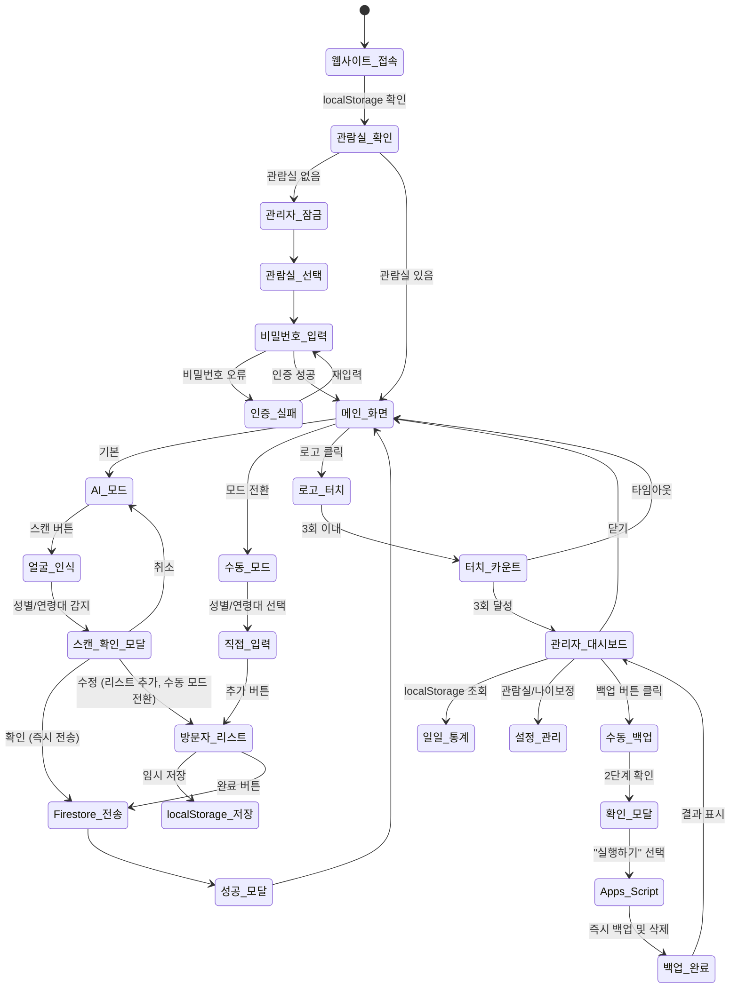
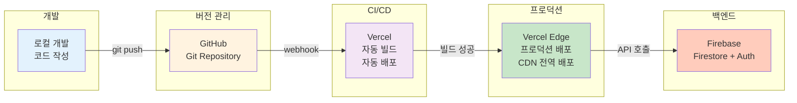
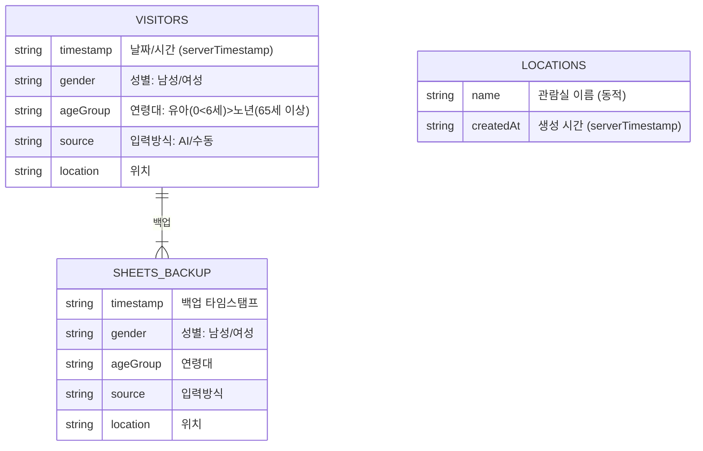

# 시스템 아키텍처

## 1. 전체 시스템 아키텍처

```mermaid
graph TB
    subgraph "사용자 계층"
        USER["👤 사용자 (웹 브라우저)"]
    end
    
    subgraph "접근 제어"
        LOCK["관리자 잠금 화면<br/>최초 진입 시 필수<br/>관람실 선택 + 비밀번호"]
    end
    
    subgraph "프론트엔드 - 메인 화면"
        MAIN["메인 화면<br/>잠금 해제 후 접근"]
        UI1["카메라 체크인<br/>AI 얼굴 인식"]
        UI2["수동 입력<br/>직접 입력"]
        LOGO["로고 (3번 터치)<br/>대시보드 진입"]
    end
    
    subgraph "로컬 저장소"
        LOCAL["localStorage<br/>일일 데이터 임시 저장<br/>자정마다 초기화"]
    end
    
    subgraph "관리자 기능"
        ADMIN["관리자 대시보드<br/>일일 통계<br/>설정 관리<br/>수동 백업"]
    end
    
    subgraph "AI/ML 계층"
        FACE["face-api.js<br/>얼굴 인식 엔진"]
        MODEL["성별 감지<br/>연령대 분류"]
    end
    
    subgraph "데이터 계층"
        FIRESTORE["Firebase Firestore<br/>방문객 데이터 (visitors)<br/>관람실 데이터 (locations)<br/>Apps Script로만 조회"]
        CACHE["localStorage 캐시<br/>일일 통계 임시 저장<br/>관람실 목록 캐시"]
    end
    
    subgraph "자동화 계층"
        APPS["Google Apps Script<br/>자동 스케줄러<br/>설정 간격"]
        FUNC1["데이터 조회"]
        FUNC2["Sheets 백업"]
        FUNC3["안전한 삭제"]
    end
    
    subgraph "백업 저장소"
        SHEETS["Google Sheets<br/>영구 백업"]
    end
    
    subgraph "알림 시스템"
        EMAIL["이메일 알림<br/>오류 추적"]
    end
    
    USER -->|1. 최초 접속| LOCK
    LOCK -->|관람실 목록<br/>(캐시 우선)| FIRESTORE
    LOCK -->|인증 성공| MAIN
    MAIN --> UI1
    MAIN --> UI2
    MAIN --> LOGO
    
    UI1 --> FACE
    FACE --> MODEL
    MODEL -->|성별, 연령대| UI1
    
    UI1 -->|데이터 저장| LOCAL
    UI2 -->|데이터 저장| LOCAL
    LOCAL -->|완료 버튼| FIRESTORE
    
    LOGO -->|3번 터치| ADMIN
    ADMIN -->|통계 조회| LOCAL
    ADMIN -->|관실 CRUD| FIRESTORE
    
    FIRESTORE -->|캐시| CACHE
    
    APPS --> FUNC1
    FUNC1 -->|읽기| FIRESTORE
    FUNC1 --> FUNC2
    FUNC2 -->|백업| SHEETS
    FUNC2 --> FUNC3
    FUNC3 -->|삭제| FIRESTORE
    
    APPS -->|오류 발생| EMAIL
    
    style USER fill:#e1f5ff
    style LOCK fill:#ffcdd2
    style MAIN fill:#fff3e0
    style LOCAL fill:#fff9c4
    style LOGO fill:#c8e6c9
    style ADMIN fill:#b3e5fc
    style FIRESTORE fill:#f3e5f5
    style SHEETS fill:#e8f5e9
    style APPS fill:#fce4ec
    style EMAIL fill:#ffebee
```

---

## 2. 데이터 흐름 아키텍처



---

## 3. 사용자 접근 흐름도



---

## 4. 배포 아키텍처



---

## 5. 컴포넌트 구조

### 프로젝트 레이아웃
```
src/components/
├── modals/                    # 모달 컴포넌트
│   ├── ErrorModal.jsx         # 오류 알림
│   ├── SuccessModal.jsx       # 성공 알림
│   └── ScanConfirmModal.jsx   # AI 스캔 결과 확인
├── dashboard/                 # 대시보드 컴포넌트
│   ├── AgeGroupChart.jsx      # 연령대 분포 막대 차트
│   ├── GenderChart.jsx        # 성별 분포 도넛 차트
│   ├── BackupSection.jsx      # 데이터 백업 섹션
│   └── RoomManagementModal.jsx# 관람실 추가/삭제 모달
├── AdminLockScreen.jsx        # 관리자 인증 화면
├── CameraCard.jsx             # 카메라 스캔 영역
├── Dashboard.jsx              # 메인 대시보드 컨테이너
├── LanguageToggle.jsx         # 다국어 전환
├── ManualEntryCard.jsx        # 수동 입력 폼
└── VisitorList.jsx            # 방문자 목록 관리
```

### 주요 상태 관리 계층

**App.jsx (최상위 컨테이너)**
- `visitors[]`: 현재 리스트의 방문자 데이터
- `scannedVisitors[]`: AI 스캔 결과
- `isAIMode`: AI/수동 모드 토글
- `isModelLoaded`: face-api.js 모델 로드 상태
- Firebase 함수: `submitVisitors()` (통합 제출 로직)

---

## 6. 데이터베이스 스키마



