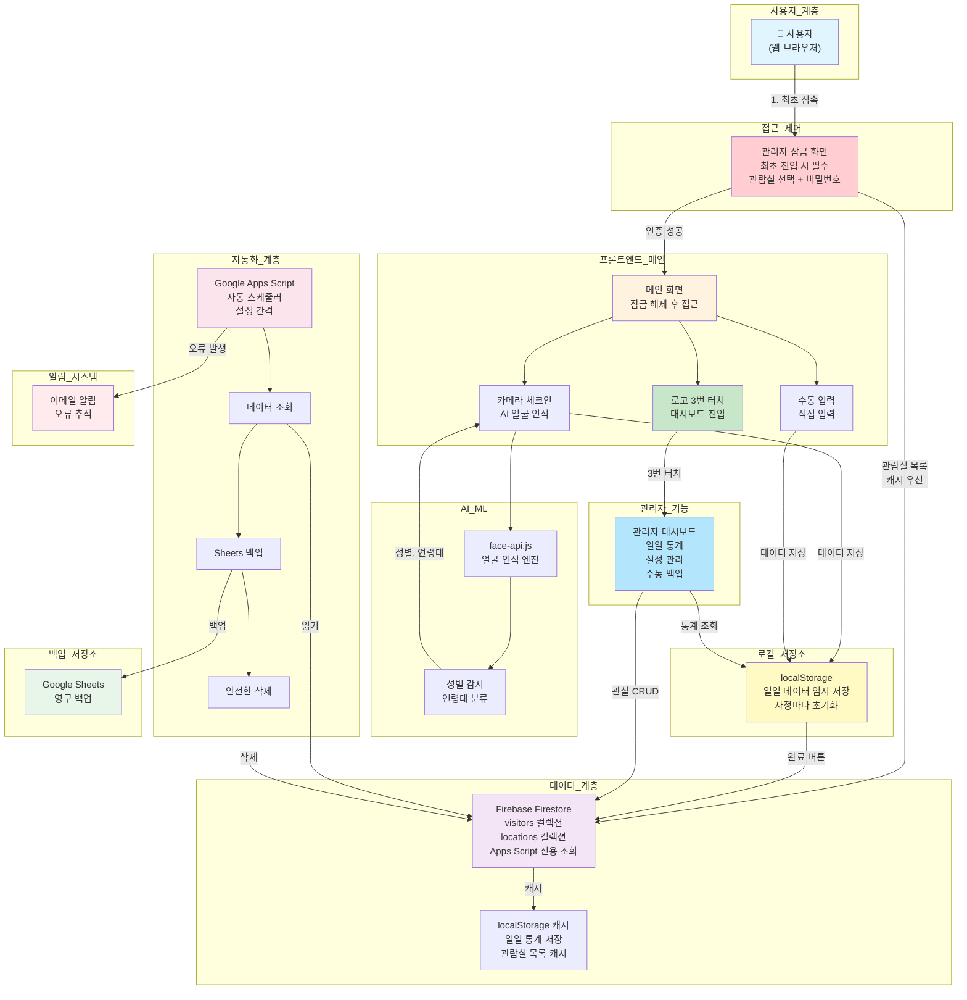
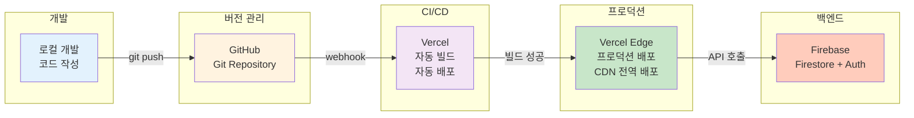
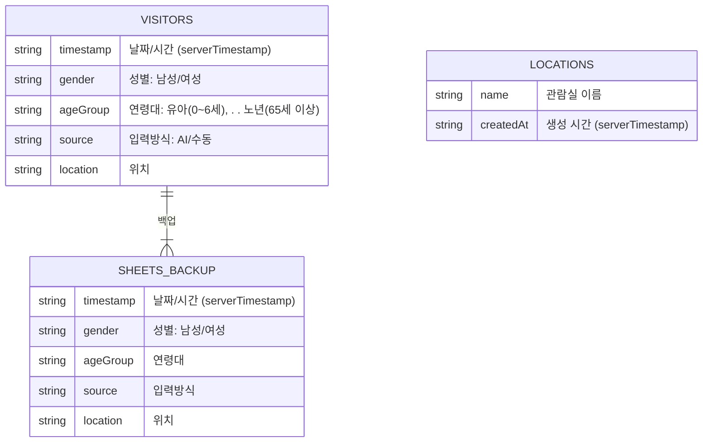

## 1. 전체 시스템 아키텍처



---

## 2. 배포 아키텍처



---

## 3. 컴포넌트 구조

### 프로젝트 레이아웃

```
src/components/
├── modals/                    # 모달 컴포넌트
│   ├── ErrorModal.jsx         # 오류 알림
│   ├── FinalConfirmModal.jsx   # AI 스캔/수동 입력 최종 확인
│   └── SuccessModal.jsx       # 성공 알림
├── dashboard/                 # 대시보드 컴포넌트
│   ├── AgeGroupChart.jsx      # 연령대 분포 막대 차트
│   ├── GenderChart.jsx        # 성별 분포 도넛 차트
│   ├── BackupSection.jsx      # 데이터 백업 섹션
│   └── RoomManagementModal.jsx# 관람실 추가/삭제 모달
├── AdminLockScreen.jsx        # 관리자 인증 화면
├── CameraCard.jsx             # 카메라 스캔 영역
├── Dashboard.jsx              # 메인 대시보드 컨테이너
├── LanguageToggle.jsx         # 다국어 전환
├── ManualEntryCard.jsx        # 수동 입력 폼
└── VisitorList.jsx            # 방문자 목록 관리
```

### 주요 상태 관리 계층

**App.jsx (최상위 컨테이너)**

- `visitors[]`: 현재 리스트의 방문자 데이터
- `scannedVisitors[]`: AI 스캔 결과
- `showScanConfirm`: 스캔 확인 모달 표시 여부
- `showSubmitConfirm`: 제출 확인 모달 표시 여부
- `isAIMode`: AI/수동 모드 토글
- `isModelLoaded`: face-api.js 모델 로드 상태
- Firebase 함수: `submitVisitors()` (통합 제출 로직)

---

## 4. 데이터베이스 스키마

