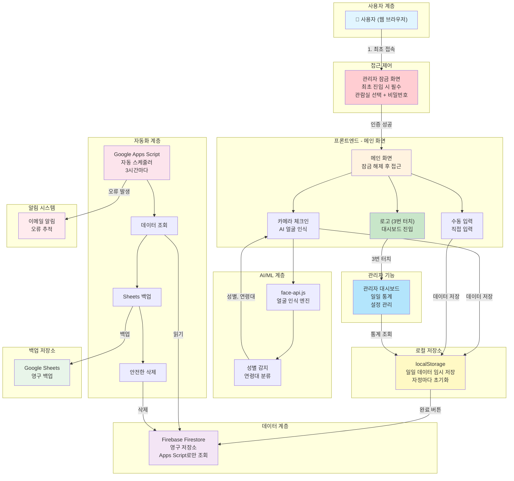
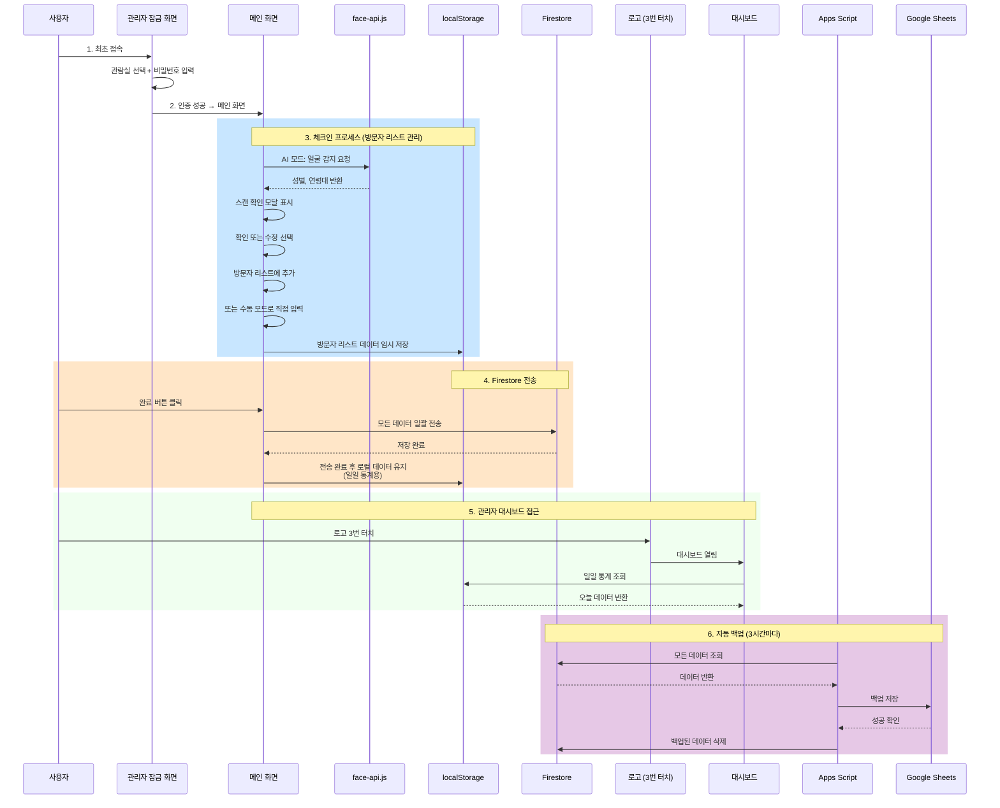
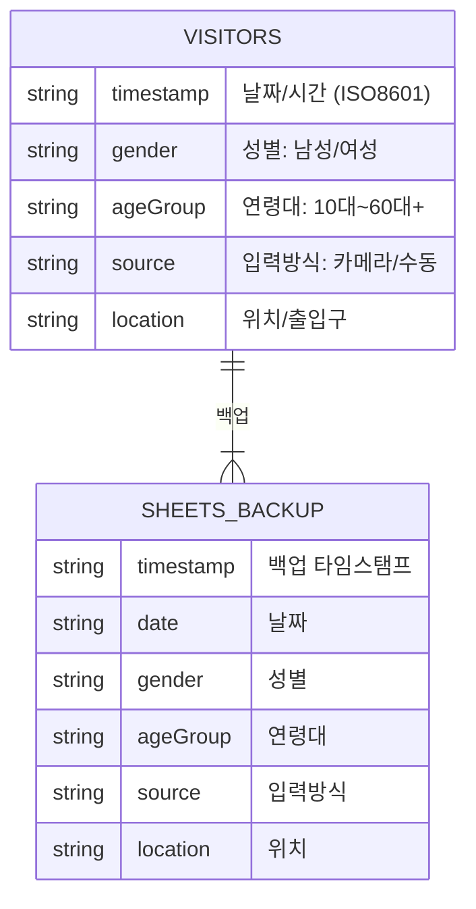
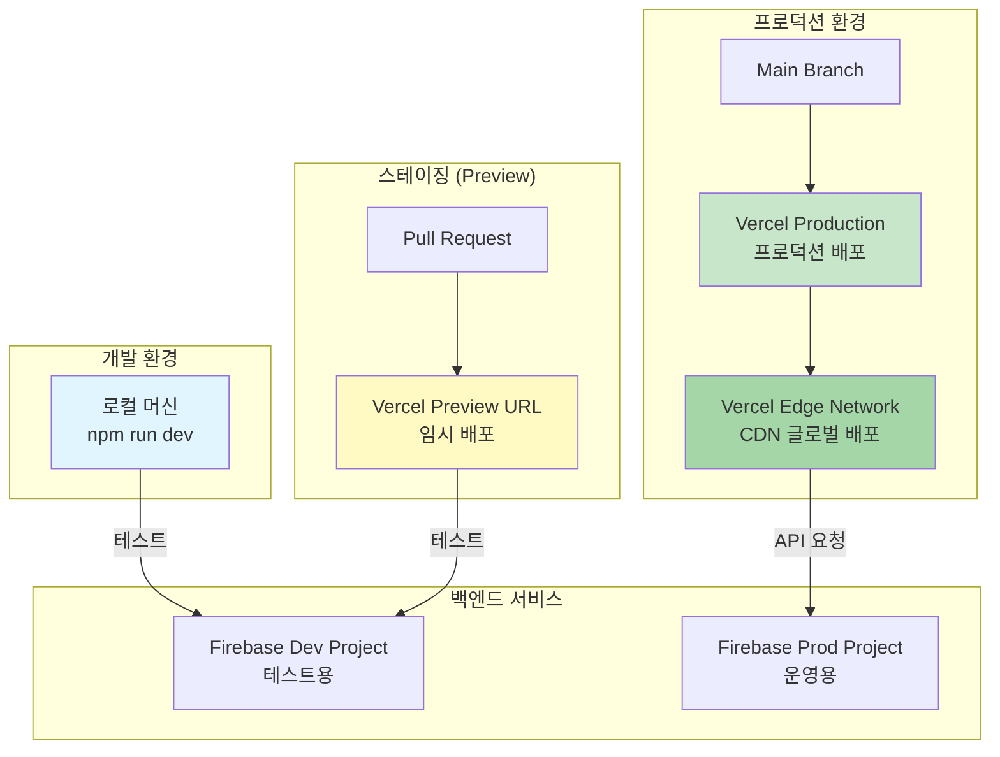

# 시스템 아키텍처

## 1. 전체 시스템 아키텍처



---

## 2. 데이터 흐름 아키텍처



---

## 3. 사용자 접근 흐름도

```mermaid
stateDiagram-v2
    [*] --> 웹사이트_접속
    
    웹사이트_접속 --> 관람실_확인: localStorage 확인
    
    관람실_확인 --> 관리자_잠금: 관람실 없음
    관람실_확인 --> 메인_화면: 관람실 있음
    
    관리자_잠금 --> 관람실_선택
    관람실_선택 --> 비밀번호_입력
    비밀번호_입력 --> 인증_실패: 비밀번호 오류
    비밀번호_입력 --> 메인_화면: 인증 성공
    
    인증_실패 --> 비밀번호_입력: 재입력
    
    메인_화면 --> AI_모드: 기본
    메인_화면 --> 수동_모드: 모드 전환
    
    AI_모드 --> 얼굴_인식: 스캔 버튼
    얼굴_인식 --> 스캔_확인_모달: 성별/연령대 감지
    
    수동_모드 --> 직접_입력: 성별/연령대 선택
    직접_입력 --> 방문자_리스트: 추가 버튼
    
    스캔_확인_모달 --> Firestore_전송: 확인 (즉시 전송)
    스캔_확인_모달 --> 방문자_리스트: 수정 (리스트 추가)
    스캔_확인_모달 --> AI_모드: 취소
    
    방문자_리스트 --> localStorage_저장: 임시 저장
    방문자_리스트 --> Firestore_전송: 완료 버튼
    Firestore_전송 --> 성공_모달
    성공_모달 --> 메인_화면
    
    메인_화면 --> 로고_터치: 로고 클릭
    로고_터치 --> 터치_카운트: 3회 이내
    터치_카운트 --> 관리자_대시보드: 3회 달성
    관리자_대시보드 --> 일일_통계: localStorage 조회
    관리자_대시보드 --> 설정_관리: 관람실/나이보정
    관리자_대시보드 --> 메인_화면: 닫기
    
    터치_카운트 --> 메인_화면: 타임아웃
    
    style 웹사이트_접속 fill:#e1f5ff
    style 관리자_잠금 fill:#ffcdd2
    style 메인_화면 fill:#fff3e0
    style localStorage_저장 fill:#fff9c4
    style 관리자_대시보드 fill:#b3e5fc
    style Firestore_전송 fill:#c8e6c9
```

---

## 4. 배포 아키텍처


---

## 5. 데이터베이스 스키마



---

## 6. 배포 환경 다이어그램



---

## 주요 특징

### 확장성
- 일일 1,000~3,000명 트래픽 처리 가능
- 트리거 간격 조정으로 유연한 대응 (1/3/6/12시간)

### 안정성
- 데이터 손실 0% (백업 후 삭제 원칙)
- 타임아웃 시 부분 백업 모드로 자동 전환
- 오류 발생 시 이메일 자동 알림

### 비용 효율성
- 총 운영비 0원/월 (무료 티어만 사용)
- 무료 한도 사용률 40% 미만 (3시간 트리거 기준)

### 배포 효율성
- Git push 시 자동 배포 (1~2분)
- 글로벌 CDN을 통한 빠른 배포
- Preview URL로 PR 검증 가능
